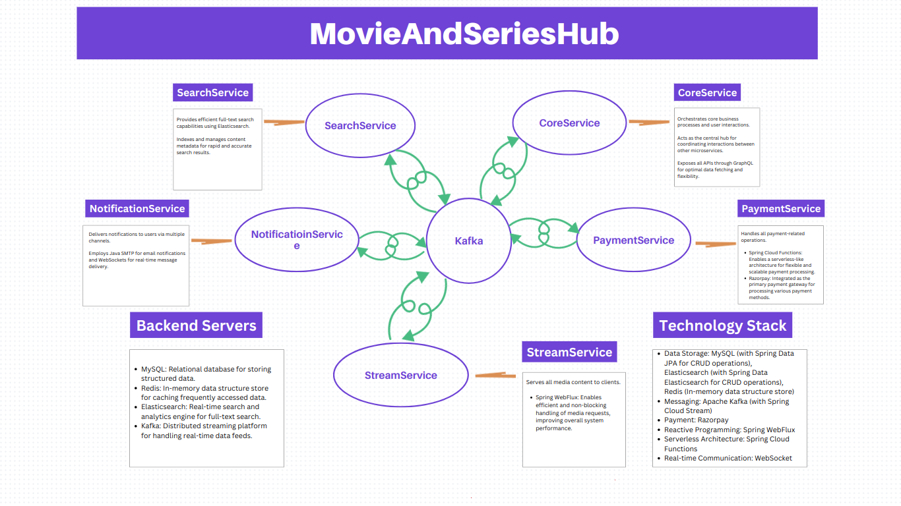

# MovieAndSeriesHub

#### Welcome to MovieAndSeriesHub, a comprehensive platform for managing and streaming movies and series. This project provides a seamless experience for users to discover, purchase, and watch movies and series with a straightforward pay-per-view model.

## 🚀 Project Architecture
```text
MovieAndSeriesHub is designed to offer a modern, scalable, and efficient media streaming service. The application is 
built using a microservices architecture, allowing for flexibility and scalability across various components. Here's 
a brief overview of the key services:

SearchService: Utilizes Elasticsearch to deliver fast and accurate full-text search capabilities, helping users find 
               their favorite movies and series with ease.
CoreService: Manages core business processes and user interactions through a GraphQL API, ensuring a robust and 
             efficient interface for client applications.
PaymentService: Handles payment transactions using Spring Cloud Functions and Razorpay, providing a secure and 
                smooth payment experience for users.
NotificationService: Sends notifications via email and real-time updates through WebSockets, keeping users informed 
                     about their activities and interactions.
StreamService: Manages media content delivery with Spring WebFlux, ensuring efficient and non-blocking streaming of 
               movies and series.
```

### 📈 Backend Architecture
```text
The backend is powered by a range of technologies to ensure performance, reliability, and scalability:

MySQL: Used for structured data storage, with Spring Data JPA for seamless database interactions.
Redis: An in-memory data store utilized for caching frequently accessed data, enhancing performance.
Elasticsearch: Provides real-time search and analytics capabilities, improving search functionality across the platform.
Kafka: A distributed streaming platform that handles real-time data feeds, supporting data integration and event-driven processing.
```

### 💡 Technology Stack
```text
Data Storage: MySQL (with Spring Data JPA), Elasticsearch (with Spring Data Elasticsearch), 
              Redis(Spring Data Redis).
Messaging: Apache Kafka (with Spring Cloud Stream).
Payment: Razorpay.
Reactive Programming: Spring WebFlux.
Serverless Architecture: Spring Cloud Functions.
Real-time Communication: WebSocket, Spring Mail.
```



### Information Of APIs will be provided soon.